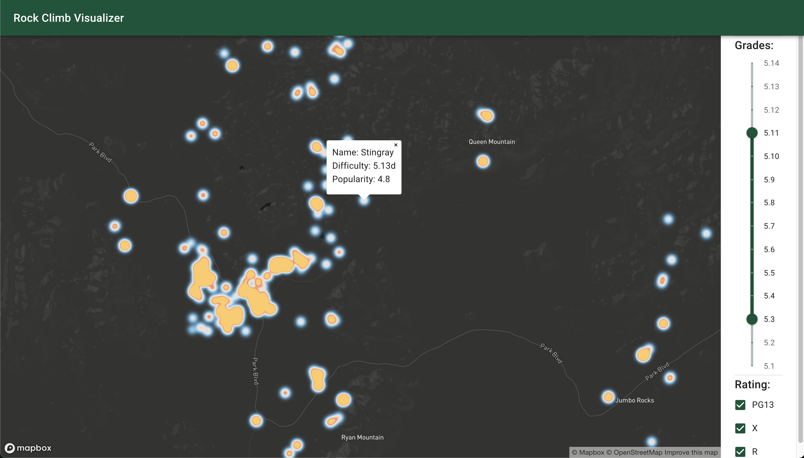

# Climb Visualizer

Demo Link : [https://climb-visualizer.herokuapp.com/](https://climb-visualizer.herokuapp.com/)

This projects uses data from Mountain Project (popular website in the U.S. to rate rock climbs) to visualize climbs by stars and difficulty. The heat map allows the user to visualize the density of highly rated climbs at each location. The slider lets the user to set of the diffculty range, and the check box lets the user to filter for protection ratings (X, R, PG13).

The climbing diffculty/grading is in Yosemite Decimal System (YDS).

This project is build using `create-react-app` with UI components from `material-UI`, the backend is created using `NestJS`.

## Technical Info
You can run the app end to end using docker (this is what Heroku uses).
```
docker build --tag climb-visualizer . 
docker run climb-visualizer
```

The front end is created using Create-React-App with Typescript.
Spin up the front end locally by going into the `front-end` folder running
```
npm install
npm run start
```

The back end is created using [nestjs](https://nestjs.com/).
Spin up the front end locally by going into the `back-end` folder running
```
npm install
npm run start
```
